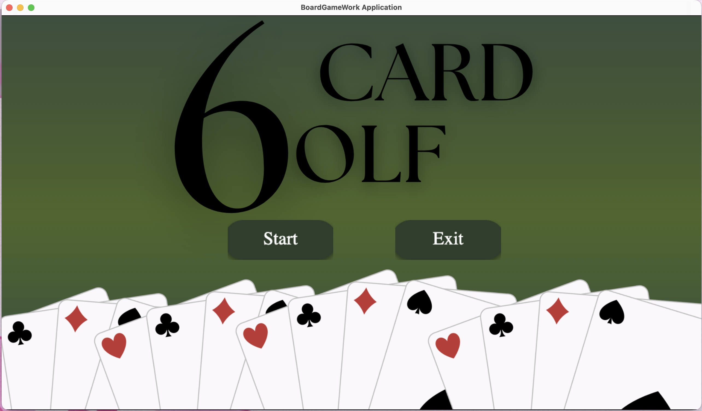
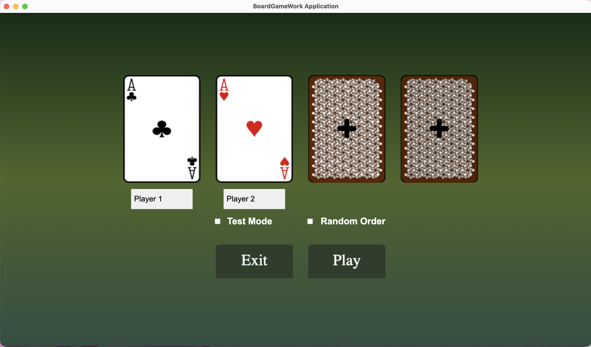
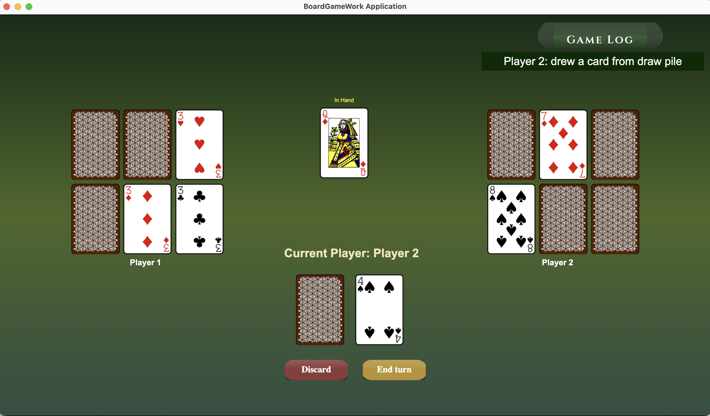
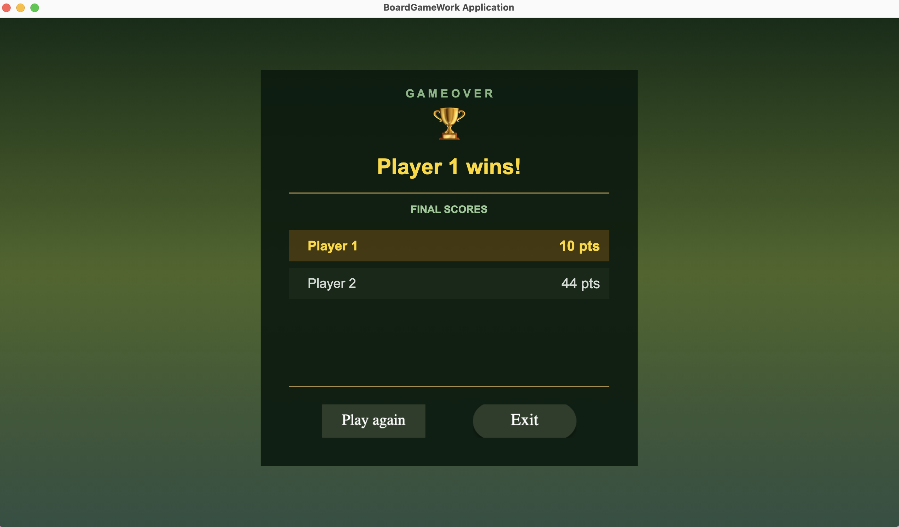

# Six Card Golf

A desktop card game built with **Kotlin** and **BoardGameWork** as a university project at TU Dortmund.

Players take turns drawing, swapping, and revealing cards, aiming to finish with the lowest score.

## Features

- Local multiplayer
- Turn-based card gameplay
- Drawing, swapping, and discarding cards
- Game log and automatic score calculation
- Test mode and randomized player order
- Unit tests for game logic

## Screenshots

<table>
  <tr>
    <td align="center">
      
      <br><b>Main Menu</b>
    </td>
    <td align="center">
      
      <br><b>Player Setup</b>
    </td>
  </tr>
  <tr>
    <td align="center">
      
      <br><b>Gameplay</b>
    </td>
    <td align="center">
      
      <br><b>Game Results</b>
    </td>
  </tr>
</table>

## Built With

- Kotlin
- BoardGameWork
- Gradle
- Kotlin Test

## Run Locally

```bash
git clone https://github.com/farahsmr/6GolfGame.git
cd 6GolfGame
./gradlew run
```

*Developed as an individual software engineering project at TU Dortmund University.*
